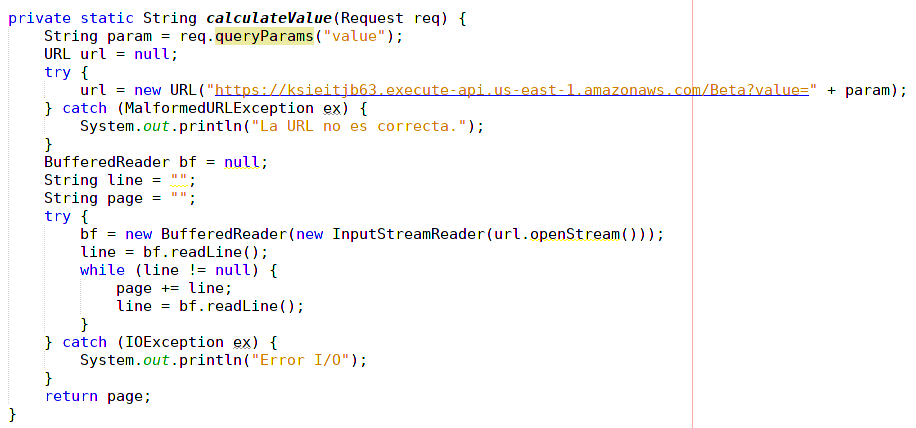
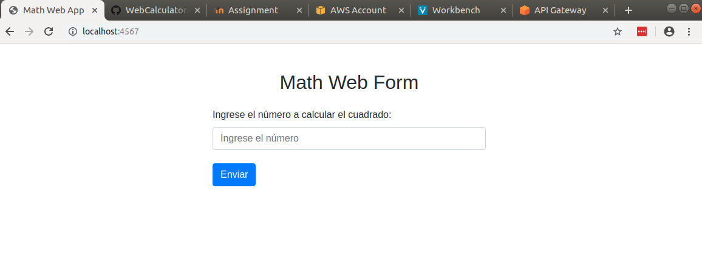
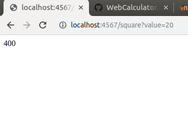
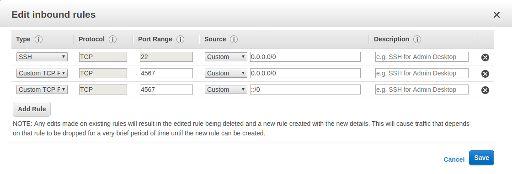
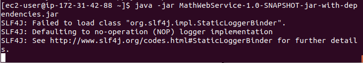
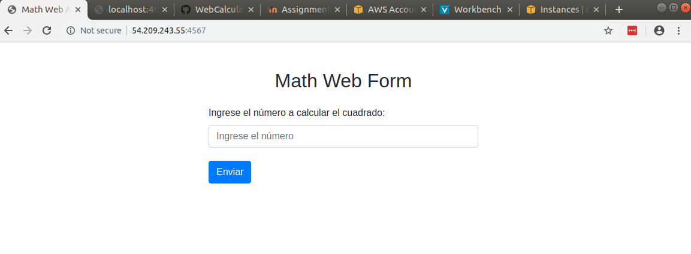
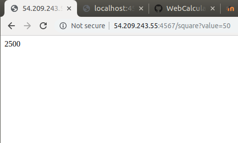

## Math Web App

## Descripción

Math Web App es una aplicación web realizada en Spark que permite calcular el cuadrado de un número ingresado por el usuario.

Para esto se tiene en la página principal un formulario. Cuando el usuario ingresa un número y procede a realizar la petición para calcular el cuadrado, la aplicación consume un servicio API REST por medio de Amazon Gateway que permite llamar a un servicio lambda con el código necesario para calcular el cuadrado del número.

Finalmente el resultado es mostrado en la página que se redirecciona después de hacer click en el botón para calcular el valor.

## Conceptos Usados

**Amazon Gateway** es un servicio de AWS que permite crear, publicar, mentener, monitorear y proteger APIs REST y WebSocket. Es posible que desde esta API se tenga acceso a diferentes servicios de AWS, además que es posible usarla en aplicaciones propias. El objetivo es que las aplicaciones creadas tenga acceso a datos, a la lógica del negocio o a funcionalidades.

**Amazon Lambda** al igual que el anterior es un servicio de AWS, el cual permite ejecutar código sin la ncesidad de aprovisionar o administrar servidores. Permite la ejecución de dicho código desde cualquier aplicación o servicio de backend.

## Pruebas

Primero se puede ver el código que permite integrar nuestra aplicación con Amazon Gateway y Lambda.

Luego se creó un formulario como el que se verá acontinuación, el cuál sólo recibe un campo que es el número a calcularle el cuadrado y el botón para calcular.

Ahora se ejecutó como *localhost* y se comprobó que efectivamente estuviera realizando la petición.

Después de haberlo probado, creamos una máquina en Amazon EC2, en donde el objetivo es desplegar nuestra aplicación. Ya con la máquina creada, es necesario cambiarle los grupos de seguridad que permitan el acceso HTTP a la máquina y sea posible realizar las peticiones.

Finalmente se cargó la aplicación en la máquina virtual EC2 y se prueba que esté funcionando correctamente.

## Creador

*Carlos Andrés Medina Rivas*

*Estudiante de Ingeniería de Sistemas de la Escuela Colombiana de Ingeniería Julio Garavito.*

## Licencia

> GNU GENERAL PUBLIC LICENSE - Version 3, 29 June 2007

Para ver más, leer el archivo [LICENSE](LICENSE.md) ubicado en la raíz de este repositorio.
